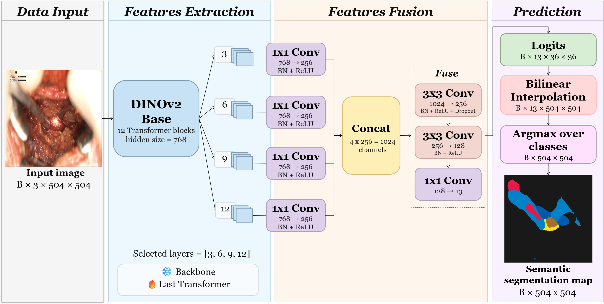

# ExoDINO

PyTorch implementation of ExoDINO for multi-class semantic segmentation in open lumbar microdiscectomy images. The model combines multi-level DINOv2 features from Transformer blocks 3, 6, 9, and 12 with a lightweight convolutional decoder.

## Repository layout

```text
exodino/
├── configs/default.yaml       # experiment configuration
├── src/exodino/               # dataset, model, loss and training utilities
├── train.py                   # training entry point
├── requirements.txt
└── .gitignore
```

## Dataset layout

The dataset is not included in this repository. It is expected to have one directory per operation:

```text
DATA_ROOT/
├── op1/
│   ├── images/
│   └── masks_semantic/
├── op2/
├── op3/
└── op4/
```

Folder names are configurable in `configs/default.yaml`. Each semantic mask is a single-channel PNG with the same basename as its RGB image.

The released semantic IDs are used directly: 0 background, 1 aspirator, 2 burr, 3 retractor, 4 spatula, 5 forceps, 6 scalpel, 7 curettes, 8 electrocautery, 9 dura, 10 ligament, 11 herniation, and 12 disc.

## Installation

```bash
python -m venv .venv
source .venv/bin/activate
pip install -r requirements.txt
pip install -e .
```

## Training one fold

Edit `configs/default.yaml` to set `data.root_dir`, `data.train_operations`, and `data.val_operations`, then run:

```bash
python train.py --config configs/default.yaml
```

The default configuration holds out `op4`. Repeat the experiment with each operation held out for leave-one-operation-out cross-validation. Outputs are stored under `outputs/<experiment_name>/` and include `best.pt`, `last.pt`, `history.csv`, and the exact resolved configuration.

## Reproducibility notes

- The default input is 504 x 504 pixels, which is divisible by DINOv2's patch size of 14.
- Training uses the custom geometric and photometric augmentation pipeline together with CutMix (probability 0.5). Validation applies only resizing and normalisation.
- Class weights are calculated once from the original training masks, before any resize, augmentation, or CutMix, and remain fixed throughout the run.
- Background is excluded from macro and micro mIoU. The training history also stores class-wise IoU values.
- Empty-mask images are included by default because they are valid background samples.
